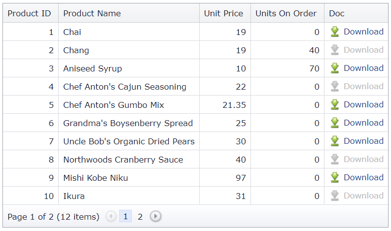

<!-- default badges list -->

[](https://supportcenter.devexpress.com/ticket/details/E5175)
[](https://docs.devexpress.com/GeneralInformation/403183)
<!-- default badges end -->
# Grid View for ASP.NET Web Forms - How to download files from a specific column
<!-- run online -->
**[[Run Online]](https://codecentral.devexpress.com/128539644/)**
<!-- run online end -->

This example demonstrates how to create a templated column with buttons that are rendered as links with icons. When a user clicks a link, the corresponding file is downloaded.



## Overview

Specify a column's [DataItemTemplate](https://docs.devexpress.com/AspNet/DevExpress.Web.GridViewDataColumn.DataItemTemplate) property, add a button to the template, and set the button's [RenderMode](https://docs.devexpress.com/AspNet/DevExpress.Web.ASPxButton.RenderMode) property to `Link`.

```aspx
<dx:GridViewDataColumn Caption="Doc" VisibleIndex="5">
    <DataItemTemplate>
        <dx:ASPxButton ID="ASPxButton1" runat="server" OnInit="ASPxButton1_Init" 
            AutoPostBack="False" RenderMode="Link" Text="Download">
            <Image IconID="actions_download_16x16" />
        </dx:ASPxButton>
    </DataItemTemplate>
</dx:GridViewDataColumn>
```

Handle the button's server-side `Init` event. In the handler, access the button's template container and get the container's key value. Then handle the button's client-side `Click` event and pass the container's key value to the `FileDownloadHandler.asxh` handler. In the handler, get the file specified by the container's key value and send this file to the browser.

```cs
protected void ASPxButton1_Init(object sender, EventArgs e) {
    ASPxButton button = (ASPxButton)sender;
    GridViewDataItemTemplateContainer container = (GridViewDataItemTemplateContainer)button.NamingContainer;

    if (FileExists(container.KeyValue)) {
        button.ClientSideEvents.Click = string.Format("function(s, e) {{ window.location = 'FileDownloadHandler.ashx?id={0}'; }}", container.KeyValue);
    }
    else {
        button.ClientEnabled = false;
    }
}

private bool FileExists(object key) {
    return !string.IsNullOrEmpty(Product.GetData().First(p => p.ProductID.Equals(key)).ImagePath);
}
```

## Files to Review

* [Data.cs](./CS/WebSite/App_Code/Data.cs) (VB: [Data.vb](./VB/WebSite/App_Code/Data.vb))
* [FileDownloadHandler.ashx.cs](./CS/WebSite/App_Code/FileDownloadHandler.ashx.cs) (VB: [FileDownloadHandler.ashx.vb](./VB/WebSite/App_Code/FileDownloadHandler.ashx.vb))
* [Default.aspx](./CS/WebSite/Default.aspx) (VB: [Default.aspx](./VB/WebSite/Default.aspx))
* [Default.aspx.cs](./CS/WebSite/Default.aspx.cs) (VB: [Default.aspx.vb](./VB/WebSite/Default.aspx.vb))

## Documentation

* [ASP.NET Futures - Generating Dynamic Images with HttpHandlers gets Easier](https://www.hanselman.com/blog/aspnet-futures-generating-dynamic-images-with-httphandlers-gets-easier)
